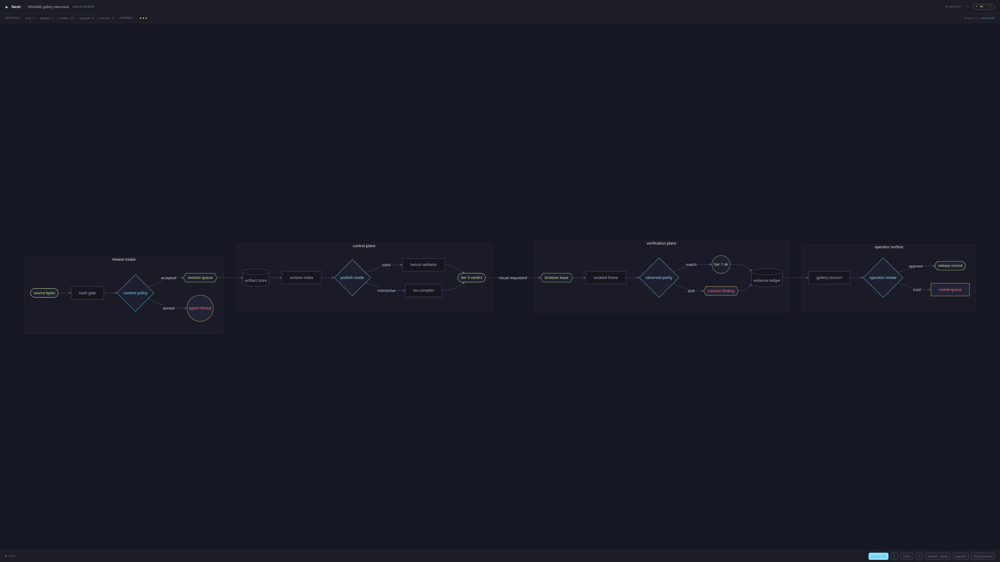
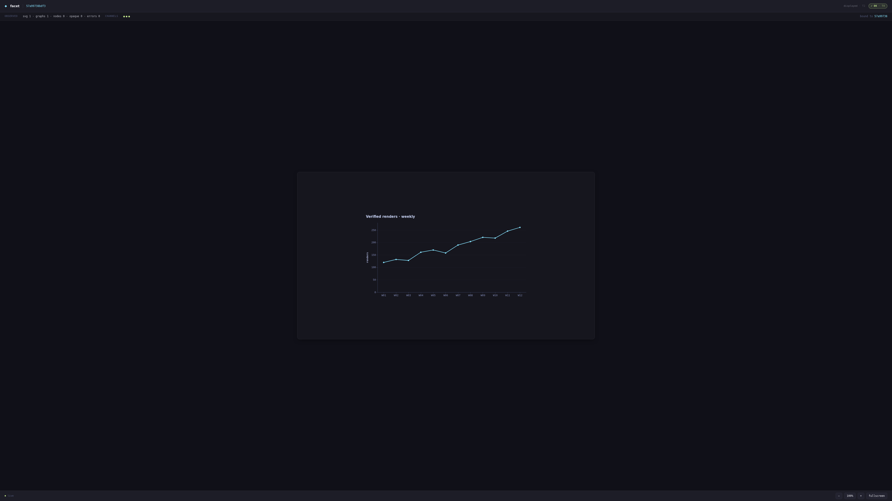

<p align="center">
  <strong>◆ facet</strong>
</p>

<p align="center"><strong>Know whether an artifact rendered — not whether a page said it did.</strong></p>

<p align="center">
  <a href="https://github.com/legion-works/facet/actions/workflows/ci.yml"></a>
  <a href="LICENSE-MIT">MIT</a> OR <a href="LICENSE-APACHE">Apache-2.0</a>
</p>

---

## Problem

An agent can emit a diagram or chart and see something that looks fine in the transcript. That is not evidence that the artifact rendered. A page can also produce a screenshot or page-shim report that says it rendered correctly; the page controls both claims.

Facet stores the source bytes without interpreting them, then asks independent validation layers what they observed. The verdict is bound to the exact revision SHA. Artifact code can influence the page, but it cannot rewrite the protocol observation after the fact.

## What it does

- Publishes `markdown`, `mermaid`, `svg`, `chart`, static `html`, and declared-mode `tsx` artifacts.
- Stores immutable revisions and keeps a ring of up to 50 per artifact.
- Runs Tier 0 browser-free checks, Tier 1 isolated browser validation, and Tier 2 display-only inspection.
- Compares lexical expectations with protocol, isolated-world, and page-shim observations.
- Serves a sandboxed, loopback gallery with revision-bound evidence and SSE updates.
- Retains Tier 1 screenshots, console output, and protocol observations under an owner-only evidence directory.
- Keeps the service byte-dumb: renderers and parsers stay outside `src/service/**`.

<p align="center">
  
</p>

<p align="center">
  
</p>

## Verdict language

The gallery and CLI use the same wire enum, glyph, hue, and treatment.

| enum (wire, verbatim)        | glyph | hue       | treatment                        |
| ---------------------------- | ----- | --------- | -------------------------------- |
| `ok`                         | `✓`   | `#c3e88d` | outline — proof, not celebration |
| `error`                      | `✗`   | `#ff757f` | outline                          |
| `partial:layout_unverified`  | `◐`   | `#ffc777` | outline; screenshot required     |
| `partial:opaque_content`     | `◐`   | `#ffc777` | outline; screenshot required     |
| `partial:external_resources` | `◐`   | `#ffc777` | outline; screenshot required     |
| `tampered`                   | `⊘`   | `#ff757f` | filled alarm badge               |
| `timeout`                    | `◌`   | `#737aa2` | dim outline                      |
| `shim_only`                  | `◇`   | `#737aa2` | dim outline                      |
| `probe_only`                 | `◈`   | `#737aa2` | dim outline                      |

`partial:external_resources` means an artifact references external HTTPS images the no-egress verifier could not load. `insecure:unvalidated` means level 3 intentionally skipped validation. A missing verdict is `UNVERIFIED` with no tier.

## Why not just screenshot it?

| Approach                    | What it can establish                                                                                    | Trust boundary                                                                                                    |
| --------------------------- | -------------------------------------------------------------------------------------------------------- | ----------------------------------------------------------------------------------------------------------------- |
| Page-shim claim             | Counts reported by JavaScript in the artifact page                                                       | Untrusted; a forged report becomes `shim_only` when the other channels are absent and `tampered` when it diverges |
| Tier 1 protocol observation | DOM and renderer observations from the verifier, compared with an isolated-world probe and the page shim | Independent of the artifact's own claim; disagreement is `tampered`                                               |
| Tier 2 display-only view    | What a human sees in the user's browser                                                                  | No validation verdict; useful for inspection, not proof                                                           |

A screenshot is evidence of pixels. It is not evidence that the page's own report was honest.

## What's in the box

- **CLI contract** — `create`, `publish`, `list`, `read-back`, `status`, `open`, `promote`, `instantiate`, `pin`, and `export` (source/render with a mandatory sidecar).
- **Artifact types** — Markdown, Mermaid, SVG, Vega-Lite chart specs, and static HTML. Chart data must be inline; external `data.url` forms are rejected. HTML is script-free, has no `<style>` block or `style=` attribute, and styles from a vendored Tailwind/daisyUI vocabulary ([reference](docs/reference/html.md)).
- **Gallery** — an offline-built shell with a direct-frame render API, a restrictive per-artifact CSP, zoom controls, and revision SSE.
- **Validation** — a 5 MiB source cap, up to 64 Mermaid blocks and 10,000 Mermaid nodes, and a 1 MiB SVG cap with 16 roots. Tier 1 uses pinned `chrome-headless-shell` `151.0.7922.77`.
- **Templates** — eleven checked-in starting points in [`templates/`](templates/), documented in [`templates/README.md`](templates/README.md).

## Quickstart

Requires Bun `1.3.14`.

```sh
bun install

bun ./src/cli/main.ts status
bun ./src/cli/main.ts create --project-id demo --slug chart --title "Chart"
printf '%s' "$SOURCE" | bun ./src/cli/main.ts publish --artifact-id <id> --type markdown --file -
bun ./src/cli/main.ts read-back --artifact-id <id> --revision-sha <sha> --tier 0
bun ./src/cli/main.ts read-back --artifact-id <id> --revision-sha <sha> --tier visual
bun ./src/cli/main.ts open --artifact-id <id> --revision-sha <sha>
bun ./src/cli/main.ts export <artifactId> --format source
```

This checkout invocation needs no global link. Use the SHA returned by the publish envelope. Tier 0 is browser-free; visual read-back is explicit Tier 1 escalation. `open` is display-only: it asks a human to inspect the sandboxed gallery and does not verify it. The CLI always writes one JSON envelope per verb to stdout; diagnostics go to stderr.

Facet's insecure mode is an explicit, boot-only opt-in (`FACET_INSECURE=1|2|3`) and is never the default. It weakens or skips validation by level, marks every affected verdict, and speaks loudly at startup, in envelopes, in the CLI, and in the gallery. `FACET_INSECURE_AUTO=1` permits startup probe fallback but never selects level 3. Restart after changing either environment variable.

## Documentation

- [Agents](docs/guides/agents.md) — the CLI workflow and adapter boundary.
- [CLI reference](docs/reference/cli.md) · [Export](docs/reference/export.md) · [HTML reference](docs/reference/html.md) · [TSX reference](docs/reference/tsx.md) · [HTTP surface](docs/reference/http.md) · [Storage reference](docs/reference/storage.md) · [Validation reference](docs/reference/validation.md) · [Security](docs/reference/security.md)
- [Architecture](ARCHITECTURE.md) · [Structure](STRUCTURE.md) · [v1 ship gate](docs/verification/v1-ship-gate.md) · [Roadmap](docs/roadmap.md)
- [Contributing](CONTRIBUTING.md)

## Status

Facet is a young, single-maintainer project. It targets local and single-operator workflows: the service binds to loopback, has no user-account authentication by design, and still protects routes with install/operator bearer capabilities. Interfaces may shift before 1.0. The publish-to-visible performance path is recorded rather than enforced on Bun `1.3.14` because its CDP transport wedges; re-measurement is gated on the Bun `1.4.0` line.

## License

MIT OR Apache-2.0, at your option. See [LICENSE-MIT](LICENSE-MIT) or [LICENSE-APACHE](LICENSE-APACHE).

---

<p align="center">
  
  &nbsp;A <strong>Legion Works</strong> product. Many programs. One consensus.
</p>
