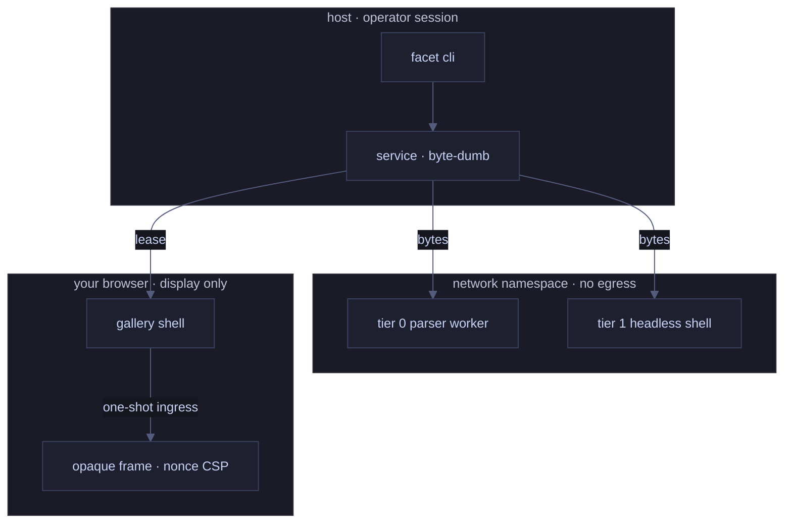
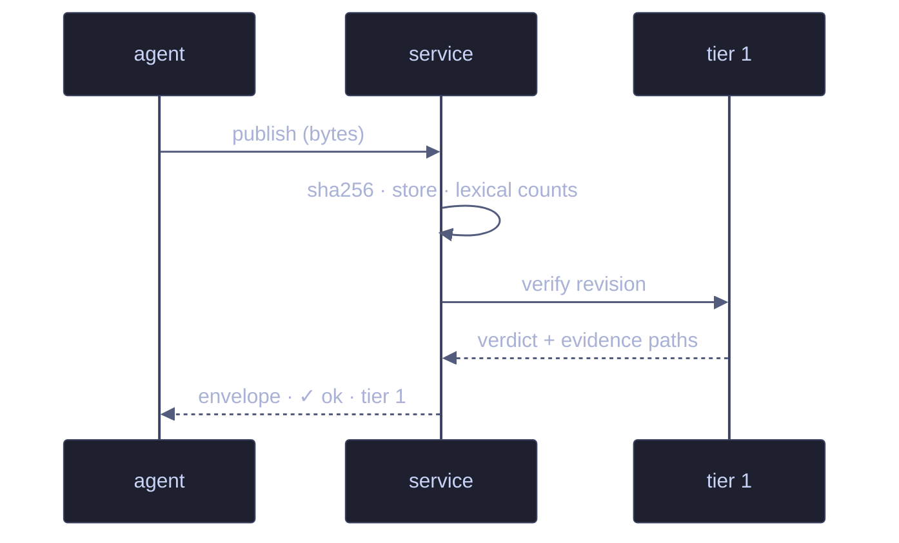
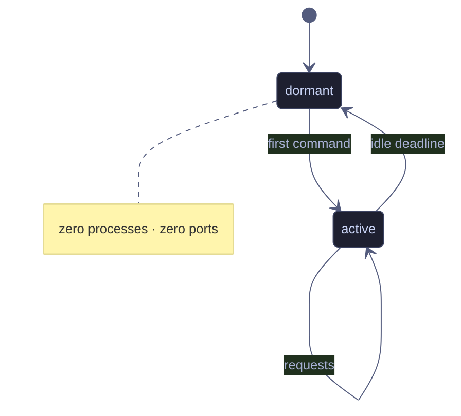

# Render verification dossier

**Verdict first.** Everything below rendered from one published markdown
artifact — tables, checklists, and three live diagrams — inside a sandboxed
frame with no network, no host capabilities, and a verdict its own code
cannot forge.

> The diagrams are not screenshots. They are mermaid sources in this file,
> rendered in isolation and counted: three fences here means the verifier
> expects exactly three renderer-owned SVG roots. Agreement is the verdict.

## Scope

| check                 | tier | expectation            |
| --------------------- | :--: | ---------------------- |
| fenced blocks counted |  0   | 3 mermaid · 1 json     |
| renderer roots        |  1   | 3 — one per fence      |
| layout observable     |  1   | non-degenerate viewBox |
| forgery probes        |  1   | shim = protocol        |

## Trust boundaries



## Publish lifecycle



## Service states



## The contract

```json
{
  "schemaVersion": "facet.v1",
  "ok": true,
  "data": { "command": "readBack", "verdict": { "status": "ok", "tier": 1 } }
}
```

## Checks

- [x] no raw HTML — markup renders as visible text, never elements
- [x] no external fetch — url-bearing sources fail closed
- [x] evidence on disk — screenshot, console, protocol observation
- [ ] promote this revision if the read-back agrees

Published with `facet publish --type markdown` · verified with
`facet read-back --tier visual`.
