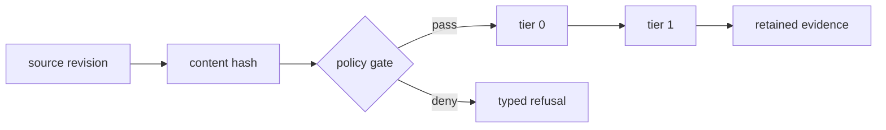
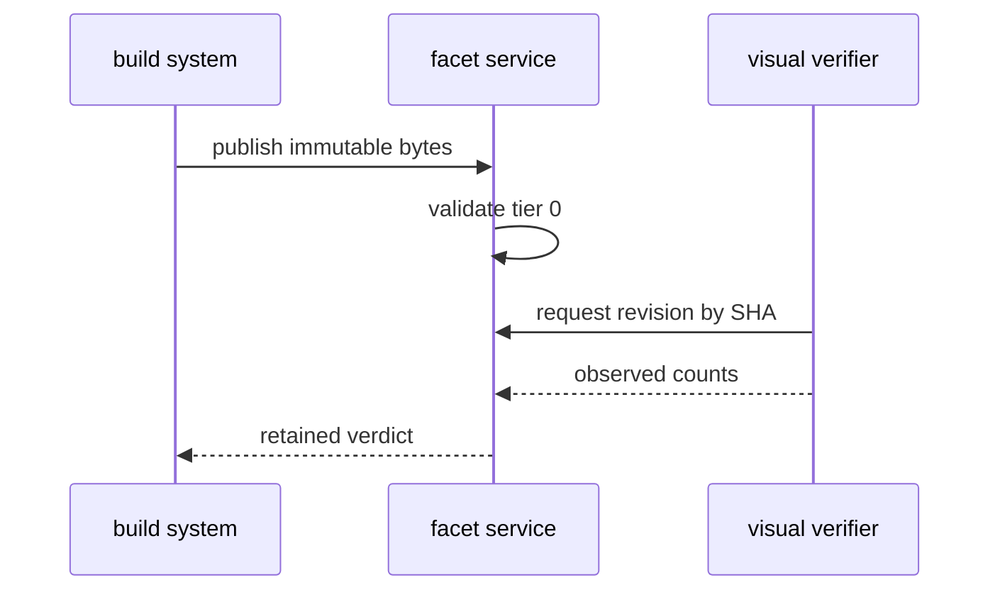

# Release pipeline audit

**Scope:** release control plane · **window:** 2026-08-14 · **verdict:** ✓ verified with two follow-ups

> The pipeline accepted only immutable inputs during this audit. One gallery limitation remains: mermaid labels are not visible in markdown renders.

## Executive signal

The release path is structurally sound from source intake through visual verification. Evidence retention and operator handoff remain the two areas that need active review.

| Control         | Owner         | Evidence                       | State       |
| --------------- | ------------- | ------------------------------ | ----------- |
| Source intake   | Build systems | immutable revision hash        | ✓ ok        |
| Tier 0 parse    | Validation    | lexical counts + policy result | ✓ ok        |
| Tier 1 render   | Verification  | browser observation            | ✓ ok        |
| Release handoff | Operations    | signed deployment record       | → follow-up |

## Audit boundary

### Inputs reviewed

- [x] Revision bytes and content address
- [x] Validation envelope persistence
- [x] Browser-backed visual read-back
- [ ] Operator acknowledgement record

### Invariants

1. A publish request names one artifact type.
2. Tier 1 observes the revision selected by its SHA.
3. Remote data and executable document features fail closed.

```ts
type AuditFinding = {
  control: string;
  status: "ok" | "follow-up";
  evidence: string[];
};

const finding: AuditFinding = {
  control: "revision identity",
  status: "ok",
  evidence: ["sha256", "tier0", "tier1"],
};
```

```bash
facet create --project-id ops-audit --slug release-pipeline-audit --title "Release pipeline audit"
facet publish --artifact-id <id> --type markdown --file templates/pipeline-audit.md
facet read-back --artifact-id <id> --revision-sha <sha256> --tier visual
```

```json
{
  "control": "tier1-parity",
  "expected": "ok",
  "evidence": {
    "rendererRootSvgCount": 2,
    "externalImageCount": 0
  }
}
```

---

## Verification path



The [CLI reference](../docs/reference/cli.md) defines the envelope contract. Use `revision.sha256`, not a later lookup, when retrieving evidence.

## Findings

| Finding                                               | Impact                        | Disposition           |
| ----------------------------------------------------- | ----------------------------- | --------------------- |
| Evidence records are revision-bound                   | avoids latest-write ambiguity | ✓ retained            |
| Mermaid labels are absent in markdown gallery renders | diagrams lose text context    | tracked visual defect |
| Handoff acknowledgement is external to publish        | requires operator evidence    | → follow-up           |

### Follow-up queue

- [ ] Attach the signed handoff record to the release review.
- [ ] Re-run the visual proof after the markdown mermaid label defect closes.
- [x] Keep source bytes and verification evidence separate.



### Operator note

> Do not treat a gallery image as a promotion authority. It proves the render path; the release record proves the handoff.
