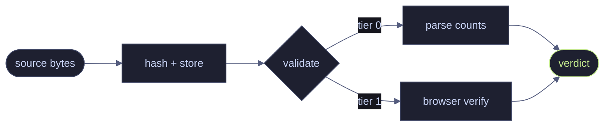

# Q3 ingest pipeline — status

**Summary.** What changed, what is verified, what is blocked. One paragraph,
verdict first.

## Numbers

| metric                |  value |  delta |
| --------------------- | -----: | -----: |
| verified renders      |  9,412 |   +261 |
| tampered caught       |      3 |     +1 |
| p95 publish → visible | 214 ms | −12 ms |

## Flow

## Next

- [ ] one action, one owner, one date
- [ ] keep the list short enough to finish
