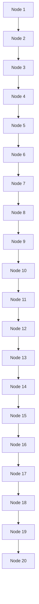
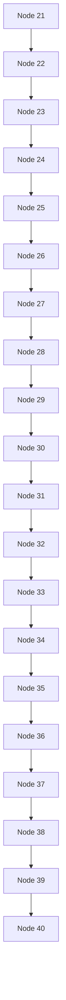

# Adversarial markdown and mermaid fixture

- Node 1
- Node 2
- Node 3
- Node 4
- Node 5
- Node 6
- Node 7
- Node 8
- Node 9
- Node 10
- Node 11
- Node 12
- Node 13
- Node 14
- Node 15
- Node 16
- Node 17
- Node 18
- Node 19
- Node 20
- Node 21
- Node 22
- Node 23
- Node 24
- Node 25
- Node 26
- Node 27
- Node 28
- Node 29
- Node 30
- Node 31
- Node 32
- Node 33
- Node 34
- Node 35
- Node 36
- Node 37
- Node 38
- Node 39
- Node 40

