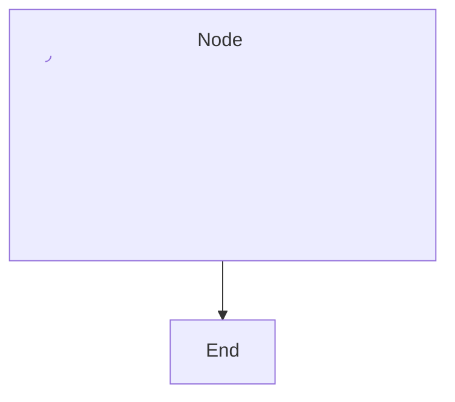

# Mermaid fixture with nested SVG label

This fixture exercises the nested-SVG forgery probe with a single mermaid block whose node label embeds a nested `<svg id="forged">…</svg>` descendant. The graph is minimal and self-consistent so it produces exactly one renderer-root SVG; the forged descendant SVG must not inflate counts.

