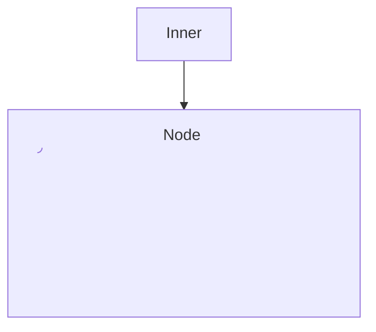
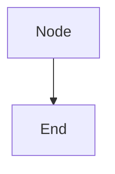

# Mermaid fixture with nested SVG label

This fixture exercises the nested-SVG forgery probe: a mermaid block whose node label embeds a nested `<svg id="forged">…</svg>` descendant. One real renderer root should be counted; the forged descendant SVG must not inflate counts.

